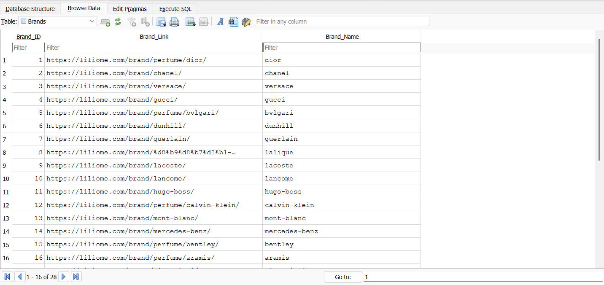
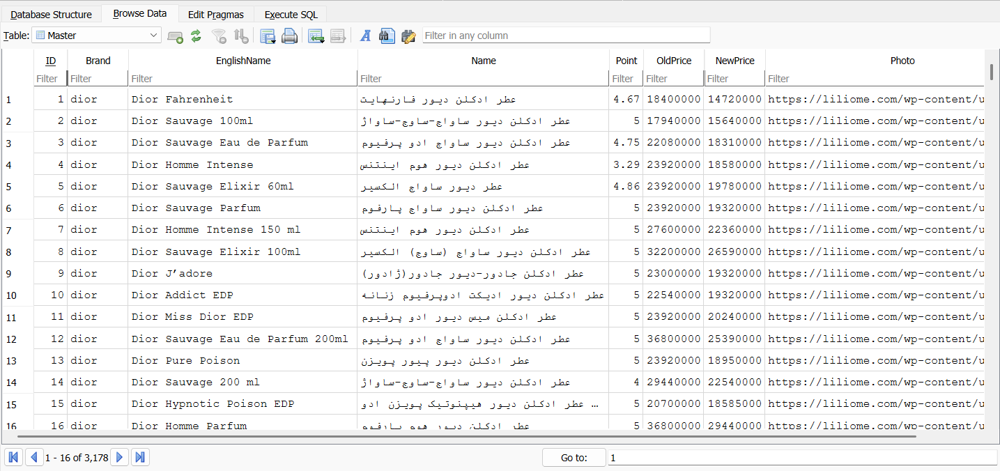

# Perfume Scraper  
A Python-based web scraper designed to extract perfume product data from **Liliome.com**, including brand information, product titles, prices, ratings, and images.  
All collected data is automatically saved into a **SQLite database (Perfume.db)**.

---

## 📌 Features

### ✔ Robust HTTP session  
- Uses `requests.Session` with retry logic  
- Handles connection failures gracefully (`safe_get()`)

### ✔ Web scraping  
- **Extracts**:
  - **Brand name**
  - **English title**
  - **Persian title**
  - **Old price**
  - **New price**
  - **Product rating (Point)**
  - **Photo URL**
- Automatically discovers all available brands and their product pages

### ✔ Pagination handling  
- Detects number of pages for each brand using `total_pages()`

### ✔ SQLite database  
Two tables are created automatically:

#### `Brands`
| Column       | Type    | Description |
|--------------|---------|-------------|
| Brand_ID     | INTEGER | Primary key |
| Brand_Link   | TEXT    | URL of brand page |
| Brand_Name   | TEXT    | Extracted brand name |

#### `Master`
| Column       | Type    | Description |
|--------------|---------|-------------|
| ID           | INTEGER | Primary key |
| Brand        | TEXT    | Brand slug |
| EnglishName  | TEXT    | Product English title |
| Name         | TEXT    | Product Persian title |
| Point        | INTEGER | Product rating |
| OldPrice     | INTEGER | Old price |
| NewPrice     | INTEGER | New price |
| Photo        | TEXT    | Image URL |

---

## 🛠 Technologies Used

- **Python 3**
- **Requests**
- **BeautifulSoup4**
- **SQLite3**
- **Retry & Timeout handling**
- **Regex for price cleanup**

---

## 📁 Project Structure

```
Perfume_Scraper/
│
├── assets/
│ └── Brands_Table.png
│ └── Master_Table.png
│
├── db/
│ └── Perfume.db # Automatically created database
│
├── Perfume_Scraper.py # Main scraper script
├── README.md
```

---

## 🚀 How It Works

### 1️⃣ Load Liliome brand list  
The script visits:


https://liliome.com/برندها-عطر-ادکلن-فروشگاه-عطر-لیلیوم


It finds all brand links and stores them in the `Brands` table.

---

### 2️⃣ For each brand:  
- Detects how many pages of products exist  
- Extracts products from each page  
- Saves structured data into the `Master` table

---

## ▶️ How to Run

1. Clone the repository:

```
git clone https://github.com/SamiraSiavash/Perfume_Scraper.git
cd Perfume_Scraper
```

2. Run the scraper:

```
python Perfume_Scraper.py
```

---

## 📊 Output

Data will be saved automatically into:

```
perfumes.db
```

Inside a table such as:

```
Master(ID, Brand, EnglishName, Name, Point, OldPrice, NewPrice, Photo)
```

---

## 🖼 Screenshots
```markdown

```


```markdown

```


---

## 📝 Notes

* Adjust CSS selectors depending on website structure.
* Website layouts may change; update selectors accordingly.
* Always follow the target website’s Terms of Service.

---

## 📄 License
MIT License (optional)

---

## ✨ Author
**Samira Siavash**

🔗 GitHub: [https://github.com/SamiraSiavash](https://github.com/SamiraSiavash)

🔗 LinkedIn: [https://linkedin.com/in/samira-siavash](https://linkedin.com/in/samira-siavash)
